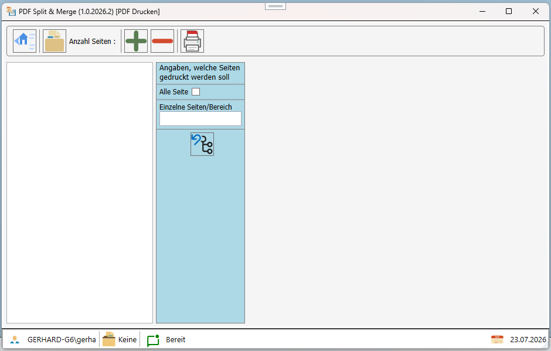

# PDF Split und Merge

# Projekt
Das Projekt dient dazu, PDF Dateien zu splitten, zusammenzufügen, Drucken und Scannen.
Der Fokus liegt aber auf der Möglichkeit, PDF Dokumente zu splitten und zusammenzufügen.

## Splitten von PDF Dateien

Für das splitten von PDF Dateien stehen verschiedene Möglichkeiten zur Verfügung. Es können einzelne Seiten, ein Bereich von Seiten oder jede Seite in eine eigene Datei gespeichert werden. 
Eine weite Funktion ist, das aus einem bestehenden PDF Dokument, ein Bereich von Seiten extrahiert und in einem neuen PDF Dokument gespeichert werden kann.

## Zusammenführen von PDF Dateien
Es können einzelne PDF Dateien in eine neue PDF Datei zusammengeführt werden. Dabei können die einzelnen PDF Dateien in der Reihenfolge sortiert werden, wie sie im neuen PDF Dokument erscheinen sollen.

## Drucken von PDF Dokumenten

## Scannen von PDF Dokumenten

# Hinweis
Ein bearbeiten der PDF Datei ist mit diesem Tool nicht möglich. Es können nur PDF Dateien zusammengeführt, gesplittet oder extrahiert werden werden.
# zusätzliche NuGet-Pakete
In der Anwendung/Demo werden folgende zusätzliche Pakete verwendet

|NuGet-Paket|Lizenz|Beschreibung|
|:------|:--|:-----------|
|PDFiumCore|Apache License 2.0|PDFiumCore ist eine .NET-Bibliothek zum Rendern und Bearbeiten von PDF-Dokumenten.|
|PdfSharpCore|MIT|PdfSharpCore ist eine .NET-Bibliothek zum Bearbeiten von PDF-Dokumenten.|

- Erste Version
