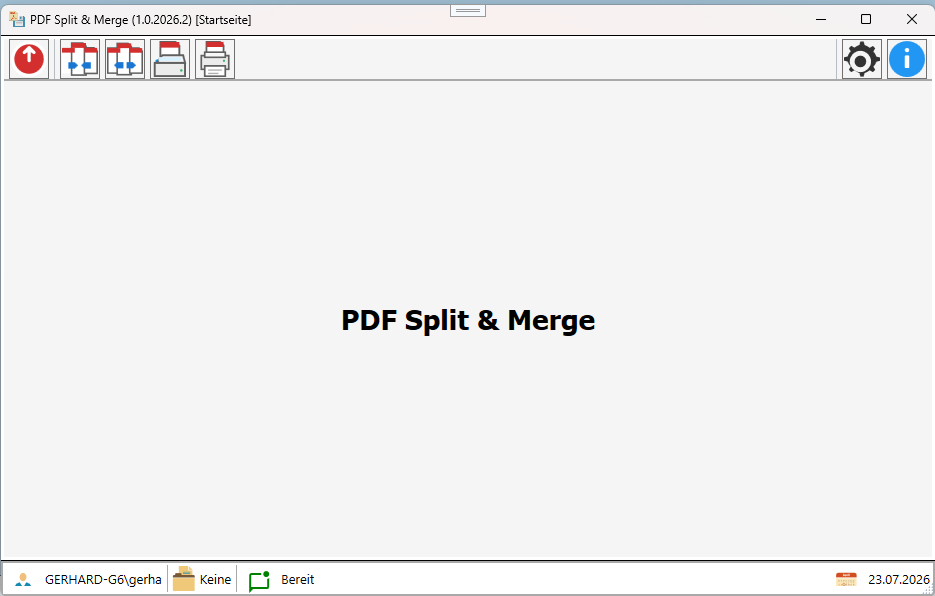
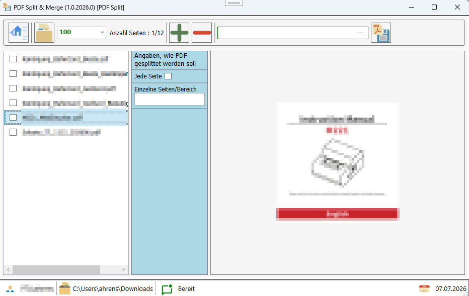
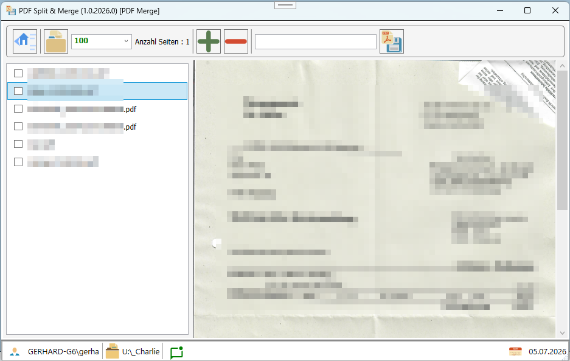

# PDF Split und Merge

# Projekt
Das Projekt dient dazu, PDF Dateien zu splitten und zusammenzufügen.

## Splitten von PDF Dateien

## Zusammenführen von PDF Dateien

# zusätzliche NuGet-Pakete
In der Anwendung/Demo werden folgende zusätzliche Pakete verwendet

|NuGet-Paket|Lizenz|Beschreibung|
|:------|:--|:-----------|
|PDFiumCore|Apache License 2.0|PDFiumCore ist eine .NET-Bibliothek zum Rendern und Bearbeiten von PDF-Dokumenten.|
|PdfSharpCore|MIT|PdfSharpCore ist eine .NET-Bibliothek zum Bearbeiten von PDF-Dokumenten.|

- Erste Version
