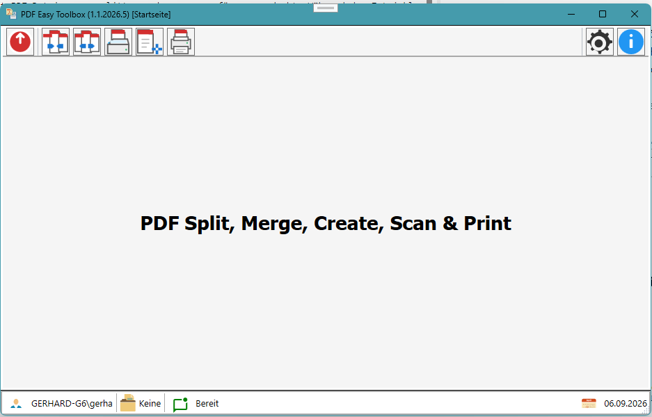
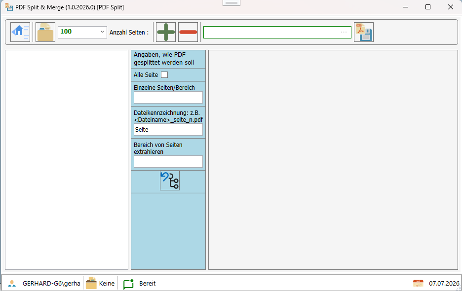
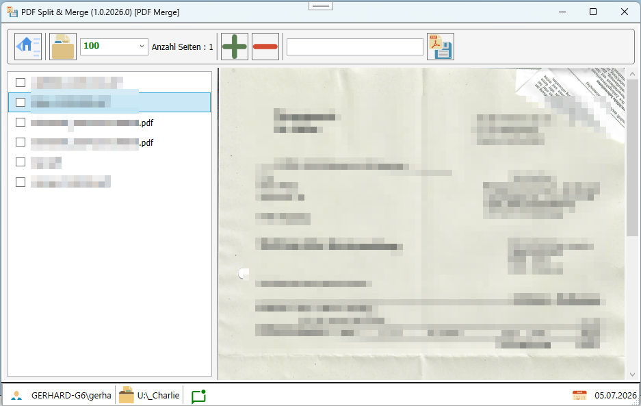
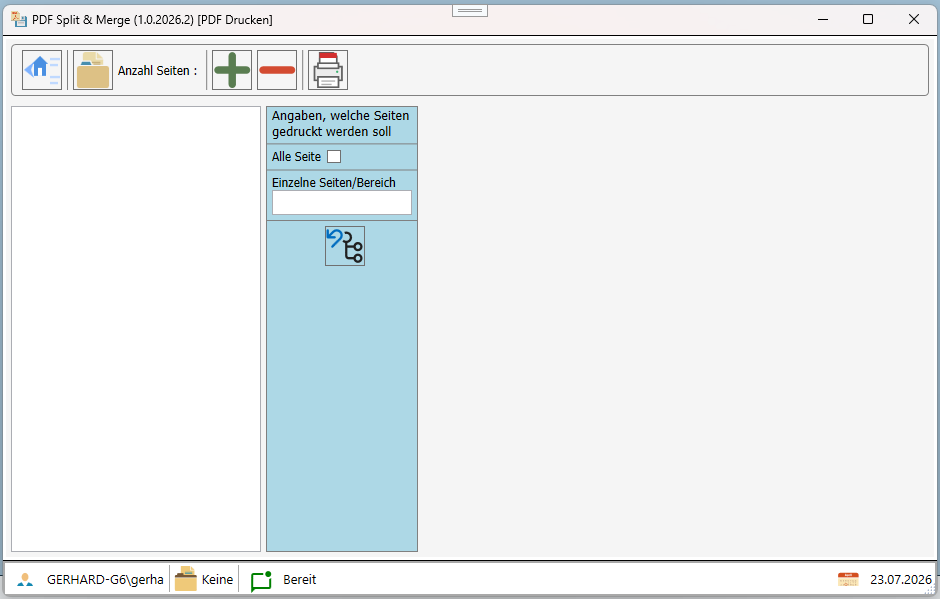
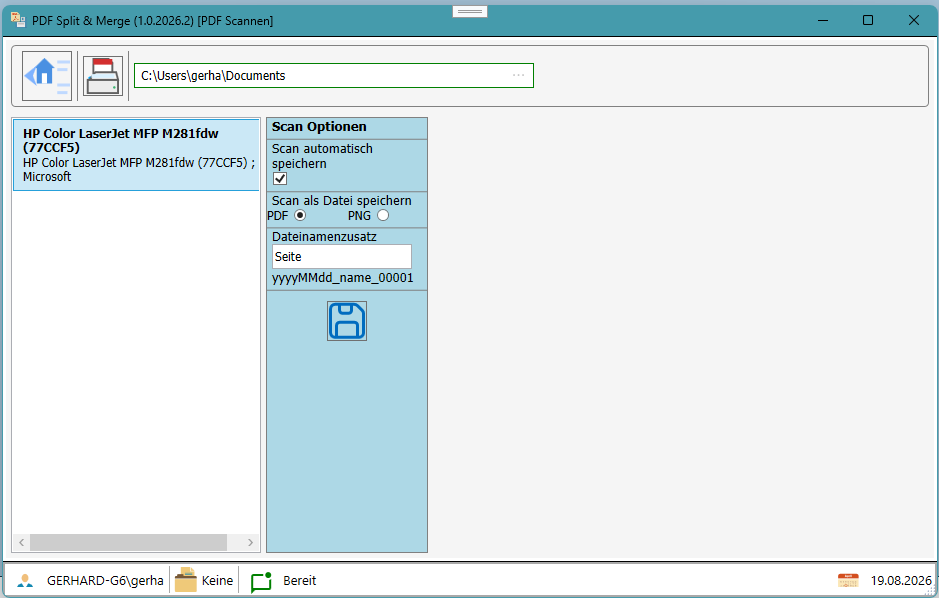

# PDF Split, Merge, Scan, Print

# Projekt
Das Projekt dient dazu, PDF Dateien zu splitten, zusammenzufügen, Drucken und Scannen.
Der Fokus liegt aber auf der Möglichkeit, PDF Dokumente zu splitten und zusammenzufügen. Zudem ist es möglich ein Dokument zu scannen aber auch zu drucken.
Ursprünglich war nur die Möglichkeit PDF Dateien, zu splitten und zusammenzufügen angedacht. Wähernd der Entwicklung haben ich mir dann auch Gedanken über Drucken und Scannen gemacht, und dieses in zwei weiteren Dialogen implementiert.

Die Anwendung ist als Singel Page Application gebaut. Die Icon / Symbole sind auf Basis vom `DrawingImage`erstell.

# Grundsätzliche Funktionsweise
Über die Bibliothek `PDFiumCore` können PDF Seiten in Images konvertiert werden. Dadurch kann in einem PDF durch die einzelnen Seiten geblättert bzw auch gedruckt werden.
Zum Splitt & Merge kommt `PdfSharpCore` zum Einsatz. Das Scannen erfolgt per WIA (Windows Image Acquisition).

## Splitten von PDF Dateien

Für das splitten von PDF Dateien stehen verschiedene Möglichkeiten zur Verfügung. Es können einzelne Seiten, ein Bereich von Seiten oder jede Seite in eine eigene Datei gespeichert werden. 
Eine weite Funktion ist, das aus einem bestehenden PDF Dokument, ein Bereich von Seiten extrahiert und in einem neuen PDF Dokument gespeichert werden kann.

## Zusammenführen von PDF Dateien
Es können einzelne PDF Dateien in eine neue PDF Datei zusammengeführt werden. Dabei können die einzelnen PDF Dateien in der Reihenfolge sortiert werden, wie sie im neuen PDF Dokument erscheinen sollen.

## Drucken von PDF Dokumenten
Das Drucken von PDF ist möglich aber ohne Einfluss auf das Dokument selbst.

## Scannen von PDF Dokumenten
Das Scannnen erfolgt über WIA (Windows Image Acquisition) und hat somit keinen Einfluß auf Optionen. Grundsätzlich kann über WIA USB- und Netzwerkscanner angesprochen werden.
WIA Ist COM-basiert, funktioniert mit vielen Scannern, hat aber auch seine Tücken für Netzwerk Scanner. Vor allem ist es schwer zu prüfen, ob eine Scanner auch tatsächlich betriebsbereit ist.

# Hinweis
Ein bearbeiten der PDF Datei (auch Notizen und Markierungen) ist mit diesem Tool nicht möglich. Es können nur PDF Dateien zusammengeführt, gesplittet oder extrahiert werden werden.
# zusätzliche NuGet-Pakete
In der Anwendung/Demo werden folgende zusätzliche Pakete verwendet

|NuGet-Paket|Lizenz|Beschreibung|
|:------|:--|:-----------|
|PDFiumCore|Apache License 2.0|PDFiumCore ist eine .NET-Bibliothek zum Rendern und Bearbeiten von PDF-Dokumenten.|
|PdfSharpCore|MIT|PdfSharpCore ist eine .NET-Bibliothek zum Bearbeiten von PDF-Dokumenten.|

- Erste Version
